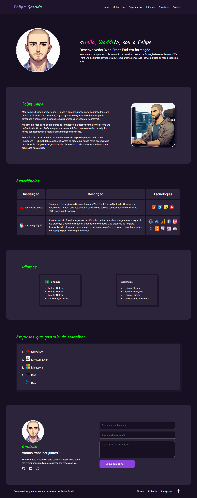

## Santander Coders 2024 | Módulo 1 - Front-End Estático | Projeto 1: CV/Portfólio

- Projeto individual realizado com os conhecimentos obtidos na primeira metade do módulo Front-End Estático durante a formação Desenvolvimento Front-end do Santander Coders 2024.

## Professor
- [Luís Fernando Teixeira Bicalho](https://www.linkedin.com/in/lu%C3%ADs-fernando-teixeira-bicalho-a4b210158/)

## Descrição do projeto

Desenvolver, utilizando os conceitos abordados até a primeira metade do módulo, um CV/Portfólio.

## Requisitos

- Uma imagem profissional sua e seu nome completo;
- Um parágrafo falando mais sobre você;
- Para cada empresa ou projeto no qual você trabalhou, botar uma imagem da logo ou ilustrativa, e indicar a experiência que teve nela e quais linguagens utilizou (formato de tabela);
- Apresentar uma lista das línguas que tem proficiência (indicar nível ao lado, sendo os mesmos do Linkedin);
- Apresentar um ranking de empresas que deseja trabalhar;
- Lembre-se de separar as seções acima, indicando-as por títulos próprios;
- Apresentar um formulário no final da página para que possam entrar em contato;
- A página deve ter um header, com navegação entre seções, e um footer;
- Utilize o máximo de CSS possível para deixar o seu currículo apresentável;
- A navegação deve funcionar na mesma página, com uma animação indo até a seção clicada;
- Otimizar a sua página para SEO e deixá-la mais acessível.

## Tecnologias utilizadas

- HTML Semântico
- CSS

## Resultado final

[Link do Deploy](https://fgarrido-dev.github.io/Projeto-Curriculo/)
